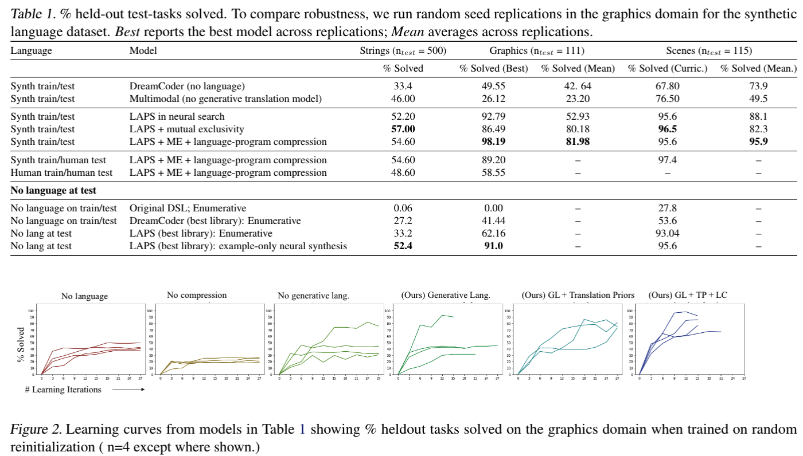

#  Leveraging Language for Abstraction and Program Search

This repository is the official implementation of Leveraging Language for Abstraction and Program Search (ICML 2021, Wong et. al 2021).
This repository and branch is a static branch designed to reproduce the results in the paper.

## Getting Started -- Dependencies and Requirements
The following setup has been tested on an Ubuntu 16.04 machine. The codebase is implemented in both Python and OCaml.
##### Install Python 3.7.7 and the Python requirements.
1. We test our implementation on Python 3.7.7. On Linux, you can create a fresh install (including pip) with:
```
sudo apt-get update; sudo apt-get install software-properties-common;
sudo add-apt-repository ppa:deadsnakes/ppa; sudo apt-get update;
sudo apt-get install python3.7; sudo apt install python3.7-dev;
sudo apt install python3-pip; python3.7 -m pip install pip;
pip install --upgrade setuptools;
```
2. Install the requirements.
```
pip install -r requirements.txt;
pip install -r language_requirements_3_7_7.txt
```
3. Test the setup is correct by running using python-only functions without language.
```
python bin/list.py --enumerationTimeout 1 --recognitionTimeout 0 --iterations 1 --solver python --compressor stitch --primitives rich
```

4. Download the NLTK Tokenizer. At an interactive Python prompt, run:
```
> import nltk; nltk.download('punkt')
```

##### Build the OCaml binaries.
The repository contains prebuilt OCaml binaries that should run on most Linux-based machines. However, to build the OCaml binaries from scratch, you can run the following from the root of the repo.
1. Install Opam.
```
sudo apt install opam
```
2. Install the OCaml dependencies.
```
make setup-ocaml
```
3. Run the following from the directory root to build the binaries.
```
make
```

##### Download Moses.
The codebase uses the [Moses](http://www.statmt.org/moses/?n=Moses.Releases) statistical machine translation system to implement the joint generative model for translating between program and natural language tokens.
On an Ubuntu 16.04 machine, you can download and use the prebuilt Moses binaries directly. (Binaries for [Ubuntu 17.04](http://www.statmt.org/moses/RELEASE-4.0/binaries/) are also available, as well as instructions for compiling from scratch on other architectures. As a caveat, we found this particularly hard to get working on a Mac machine.)

From the root of the directory, run:
```
wget http://www.statmt.org/moses/RELEASE-4.0/binaries/ubuntu-16.04.tgz;
tar -xvf ubuntu-16.04.tgz; mv ubuntu-16.04/ moses_compiled;
rm -rf  ubuntu-16.04.tgz;
```

##### Datasets
The datasets used in this paper are released in three versions (e.g. containing 200, 500, and 1000 training tasks) for evaluating data efficiency. We use the ```logo_unlimited_200``` and ```re2_1000``` datasets in the paper.
All datasets have the following directory structure.
```
|_ logo                           # Domain name.
  |__ language                    # Contains language datasets.
      |__logo_unlimited_200       # Dataset version (e.g. 200 tasks.)
          |_ synthetic            # Synthetic language data.
              |_train
                |_ language.json  # Language annotations.
                |_ vocab.json     # Vocabulary.
              |_test ...
          |_ human   ...          # Where available, human language data.
      |...
  |
  |__ tasks                       # Contains task example specification.
      |__logo_unlimited_200       # Dataset version.
          |_ train                # Contains domain-specific tasks.
          |_ test
```
Domain-specific loaders are provided for each dataset. See Training, below.
###### String Editing Domain
The string editing (regex) dataset is available on Zenodo [here](https://zenodo.org/record/3889088#.XuGEWp5KhTY).
The unzipped dataset should be stored in ```data/re2```. Our paper uses the ```re2_1000``` dataset (consisting of 1000 training tasks and 500 testing tasks).
The dataset tasks and human language comes from the regex domain in *Learning with Latent Language* (Andreas et. al, 2017) [[paper](https://arxiv.org/abs/1711.00482)] [[code](https://github.com/jacobandreas/l3)]

This dataset contains synthetic language and human language for all three training task versions. Tasks are stored in JSON containing the example inputs and outputs, but can be loaded with the domain-specific dataset loader.

###### Compositional Graphics Domain
The graphics programs (LOGO) dataset is available on Zenodo [here](https://doi.org/10.5281/zenodo.3889096).
The unzipped dataset should be stored in ```data/logo```. Our paper uses the ```logo_unlimited_200``` dataset (consisting of 200 training tasks and 111 testing tasks).

This dataset contains synthetic language for the 200, 500, and 1000 training task versions (and the 111 testing tasks); and human data for the 200 task version. We also provide rendered images for each task. Tasks are stored in the codebase-specific task format (which includes ground truth programs), and must be loaded through this repository (see Training).

The repository also contains code to generate the compositional graphics datasets from scratch (and synthetic language).
```
python bin/logo.py \
--generateTaskDataset [logo_unlimited_200 | logo_unlimited_500 | logo_unlimited_500] \
--generateLanguageDataset [logo_unlimited_200 | logo_unlimited_500 | logo_unlimited_500] \
```
###### Scene Reasoning Domain
The scene reasoning dataset is available on Zenodo [here](https://doi.org/10.5281/zenodo.4533370).
The unzipped dataset should be stored in ```data/clevr```.

Code to generate the scene reasoning datasets and their synthetic annotations, as well as to render the images, is provided at this repository [here](https://github.com/CatherineWong/too_clevr) [Warning: this is a link to a live GitHub repository. Do not click during the review period].
This code builds on the CLEVR generation code from *CLEVR: A Diagnostic Dataset for Compositional Language and Elementary Visual Reasoning*(Johson et. al, 2017)[[paper](http://cs.stanford.edu/people/jcjohns/clevr/)] [[code](https://github.com/facebookresearch/clevr-dataset-gen)]


## Training and Evaluation
Scripts to run the algorithm on each of the domains are located in the `bin/` directory.
By default, as the algorithm is iterative, the training scripts will both run the algorithm for a specified number of iterations, and evaluate on a held-out test task every n iterations (where n is an adjustable argument.)

Running the commands below will produce fairly verbose log outputs that include evaluation metrics, and the location of the model checkpoint. In particular, running
```
grep 'checkpoint' [LOG_FILE]
```
will print out the path of the checkpoints at each iteration, and running

```
grep 'testing tasks' [LOG_FILE]
```
will print out the held-out task evaluation metrics.

It is also possible to resume and evaluate a model checkpoint from any iteration in training. By default, the scripts write timestamped checkpoints to a directory titled `experimentOutputs` (the exact directory appears with other informaiton in the output.)

The ```--resume [CHECKPOINT_PATH]``` commandline argument will resume training from a checkpoint, including to re-run evaluation tasks.

For additional information on the command line output (and default scripts to graph the outputs from the checkpoints), see docs/EC_README.md.

For additional information on adding new domains beyond those listed here, see docs/creating-new-domains.md.

###### Graphics Programs
The script to train and evaluate on the graphics program domain (including calling the domain-specific dataloader) is located at ```bin/logo.py```.

A full list of commandline arguments (and descriptions of their functions) can be found by running
```
python bin/logo.py -h
```

To train and evaluate the full model in the paper (LAPS + ME + language-program compression in Table 1), run:
```
python3.7 bin/logo.py \
  --enumerationTimeout 1800 \  # Search timeout (s)
  --testingTimeout 1800 \      # Search timeout on testing tasks
  --taskBatchSize 40 \         # Training batch size at each iteration
  --iterations 12 \            # By default, number of full *epochs* to run over training tasks.
  --testEvery 3   \            # Evaluate on testing tasks every n iterations
  --recognitionTimeout 1800 \  # Maximum training time for neural model.
  --taskDataset logo_unlimited_200 --languageDataset logo_unlimited_200/synthetic \                  # Task and language dataset directories from the data/ dir.
  --synchronous_grammar \      # Induce joint generative model.
  --smt_pseudoalignments 0.1 \ # Translation prior hyperparameter.
  --language_compression --lc_score 0.2 \ # Use language compression and LC hyperparameter (1 - PHI) in the main paper.
  --max_compression 5 \ # Max num. of abstractions per iteration.
  --biasOptimal --contextual  --no-cuda --recognition_0 --recognition_1 examples language --Helmholtz 0.5 --synchronous_grammar  --language_encoder recurrent  --sample_n_supervised 0 --moses_dir ./moses_compiled --smt_phrase_length 1 --language_compression  --max_compression 5 --om_original_ordering 1
```

Additional information on the commands for every experiment in the main paper can be found in the Results section.

###### String Editing
The script to train and evaluate on the text editing domain is located at ```bin/re2.py```.

A full list of commandline arguments (and documentation) can be found by running
```
python bin/re2.py -h
```

To train and evaluate the full model in the paper (LAPS + ME + language-program compression in Table 1), run:
```
python3.7 bin/re2.py  --enumerationTimeout 720 --testingTimeout 720  --iterations 10 --biasOptimal --contextual --taskBatchSize 40 --testEvery 3 --no-cuda --recognitionSteps 10000 --recognition_0 --recognition_1 examples language --Helmholtz 0.5  --skip_first_test  --synchronous_grammar  --taskDataset re2_1000 --language_encoder recurrent --languageDataset re2_1000/synthetic --primitives re2_chars_None re2_bootstrap_v1_primitives re2_vowel_consonant_primitives --moses_dir ./moses_compiled --smt_phrase_length 1 --smt_pseudoalignments 0.1  --language_compression --lc_score 0.2 --max_compression 5
```
A file with the commands for every experiment in the main paper can be found in the Results section.

###### Scene Reasoning
The script to train and evaluate on the scene resaoning domain is located at ```bin/clevr.py```.

A full list of commandline arguments (and documentation) can be found by running
```
python bin/clevr.py -h
```

To train and evaluate the full model in the paper (LAPS + ME + language-program compression in Table 1), run:
```
python3.7 bin/clevr.py --enumerationTimeout 1000 --testingTimeout 1000 --iterations 10 --taskBatchSize 40 --testEvery 1 --taskDatasets all --recognitionSteps 10000 --biasOptimal --contextual --no-cuda --moses_dir ./moses_compiled --smt_phrase_length 1 --language_encoder recurrent --max_mem_per_enumeration_thread 5000000000 --recognition_0 --recognition_1 examples language --Helmholtz 0.5 --primitives clevr_bootstrap clevr_map_transform --synchronous_grammar --smt_pseudoalignments 0.05 --lc_score 0.01 --max_compression 5 --taskReranker randomShuffle
```
Commands to reproduce each of these experiments (including replications) can be found in the ```docs/icml_2021_experiments``` file.

## Pretrained Models
Pretrained models for the best models on each domain in the paper trained with and without language in the table below are available on Zenodo [here](https://zenodo.org/record/3889158#.XuGsop5Kg8M). These are checkpoints, and should be resumed using the ```--resume``` command. They can also be used to reproduce the experimental results given in the ```docs/icml_2021_experiments``` file.

## Results
The table below (Table 1 in the main paper) shows % held-out tasks solved on both the graphics program and regex domains, including when testing and trained on synthetic and human language data; the table also shows performance on model ablations and baselines.



Commands to reproduce each of these experiments (including replications) can be found in the ```docs/icml_2021_experiments``` file.


## Contributing
MIT License
Copyright (c) 2021 Catherine Wong

Permission is hereby granted, free of charge, to any person obtaining a copy of this software and associated documentation files (the "Software"), to deal in the Software without restriction, including without limitation the rights to use, copy, modify, merge, publish, distribute, sublicense, and/or sell copies of the Software, and to permit persons to whom the Software is furnished to do so, subject to the following conditions:

The above copyright notice and this permission notice shall be included in all copies or substantial portions of the Software.

THE SOFTWARE IS PROVIDED "AS IS", WITHOUT WARRANTY OF ANY KIND, EXPRESS OR IMPLIED, INCLUDING BUT NOT LIMITED TO THE WARRANTIES OF MERCHANTABILITY, FITNESS FOR A PARTICULAR PURPOSE AND NONINFRINGEMENT. IN NO EVENT SHALL THE AUTHORS OR COPYRIGHT HOLDERS BE LIABLE FOR ANY CLAIM, DAMAGES OR OTHER LIABILITY, WHETHER IN AN ACTION OF CONTRACT, TORT OR OTHERWISE, ARISING FROM, OUT OF OR IN CONNECTION WITH THE SOFTWARE OR THE USE OR OTHER DEALINGS IN THE SOFTWARE.
