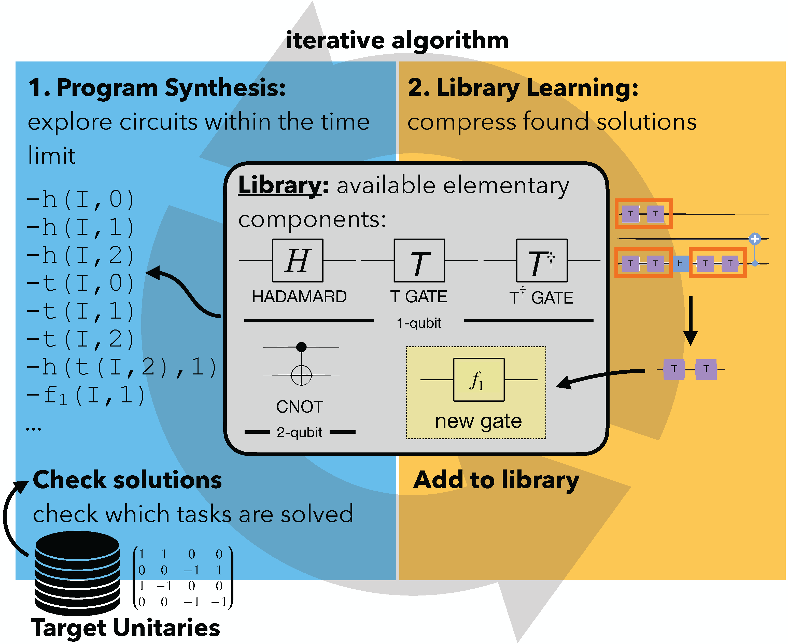

# Discovering Quantum Circuit Components with Program Synthesis


This repository provides the research code developed for the experiments shown in the paper "Discovering Quantum Circuit Components with Program Synthesis" by Leopoldo Sarra, Kevin Ellis, and Florian Marquardt.


# Getting Started

This section will provide the basic information necessary to run experiments with the quantum circuits domain.

This application builds up on the DreamCoder algorithm. Please refer to the main branch of the [repository](https://github.com/ellisk42/ec) for its general description.

## Usage

### Getting the code

Clone the codebase and its submodules.

The codebase has several git submodule dependencies.

If you’ve already cloned the repo and did not clone the submodules, run:
```
git submodule update --recursive --init
```

### Installing Python dependencies

To install Python dependencies, activate a virtual environment (or don't) and run:
```
pip install -r requirements.txt
```
Please also install a branch of Qiskit that implements the Solovay Kitaev decomposition:
```
pip install git+https://github.com/LNoorl/qiskit-terra.git@feature/sk-pass
```

### Running tasks

The general usage pattern is to run the script from the root of the repo as follows:
```
python bin/quantum_circuits.py <commandline arguments>
```

An example task command might be:
```
python bin/quantum_circuits.py --nqubit 3 -t 300
```
This runs with an enumeration timeout of a circuit with 3 qubits and recognition timeout of 300 seconds.
The default parameters and the list of possible command line arguments is inside the file `bin/quantum_circuits.py`.
- Choose the number of qubits with the `--nqubit` argument.
- The `--limitedConnectivity` flag constraints the connectivity between neighboring qubits.
- Use the `--fromGrammar` option to specify the initial grammar (it can be dumped from another run, for example).

Output is saved by default in `experimentOutputs/quantum`.

The notebook `run_job.ipynb` helps scheduling the job on a SLURM queue.


### Analyzing output

Please refer to the notebook `quantum_results_analysis.ipynb` for functions and plots to analyze the outputs of a run.

## Implementation details
The quantum circuit functions are implemented in `dreamcoder/domains/quantum_circuits.py`.

- The `main.py` file in this folder drives the iterations of the algorithms.
In particular, a dataset with the given configuration is initially generated if it does not exist. 

- The `primitives.py` file implements the quantum gates in numpy for efficiency, and defines the domain-specific language (see DreamCoder documentation).

- The `tasks.py` file handles the comparison of a proposed unitary matrix and the expected one for a given task.

## Understanding console output

The first output of the scripts - after some commandline debugging statements - is typically output from launching tasks, and will appear as follows:
```
(python) Launching list(int) -> list(int) (1 tasks) w/ 1 CPUs. 15.000000 <= MDL < 16.500000. Timeout 10.201876.
(python) Launching list(int) -> list(int) (1 tasks) w/ 1 CPUs. 15.000000 <= MDL < 16.500000. Timeout 9.884262.
(python) Launching list(int) -> list(int) (1 tasks) w/ 1 CPUs. 15.000000 <= MDL < 16.500000. Timeout 2.449733.
	(ocaml: 1 CPUs. shatter: 1. |fringe| = 1. |finished| = 0.)
	(ocaml: 1 CPUs. shatter: 1. |fringe| = 1. |finished| = 0.)
(python) Launching list(int) -> list(int) (1 tasks) w/ 1 CPUs. 15.000000 <= MDL < 16.500000. Timeout 4.865186.
	(ocaml: 1 CPUs. shatter: 1. |fringe| = 1. |finished| = 0.)
```
MDL corresponds to the space used for the definition language to store the program expressions. The MDL can be tuned by changing the `-t` timeout option, which will alter the length of time the algorithm runs as well as its performance in solving tasks.

The next phase of the script will show whether the algorithm is able to match programs to tasks. A `HIT` indicates a match and  a `MISS` indicates a failure to find a suitable program for a task:
```
Generative model enumeration results:
HIT sum w/ (lambda (fold $0 0 (lambda (lambda (+ $0 $1))))) ; log prior = -5.545748 ; log likelihood = 0.000000
HIT take-k with k=2 w/ (lambda (cons (car $0) (cons (car (cdr $0)) empty))) ; log prior = -10.024556 ; log likelihood = 0.000000
MISS take-k with k=3
MISS remove eq 3
MISS keep gt 3
MISS remove gt 3
Hits 2/6 tasks
```

The program output also contains some information about the programs that the algorithm is trying to solve each task with:
```
Showing the top 5 programs in each frontier being sent to the compressor:
add1
0.00    (lambda (incr $0))

add2
-0.29   (lambda (incr2 $0))
-1.39   (lambda (incr (incr $0)))

add3
-0.85   (lambda (incr (incr2 $0)))
-0.85   (lambda (incr2 (incr $0)))
-1.95   (lambda (incr (incr (incr $0))))
```

The program will cycle through multiple iterations of wake and sleep phases (controlled by the `-i` flag). It is worth noting that after each iteration the scripts will export checkpoint files in Python's "pickle" data format.
```
Exported checkpoint to experimentOutputs/demo/2019-06-06T18:00:38.264452_aic=1.0_arity=3_ET=2_it=2_MF=10_noConsolidation=False_pc=30.0_RW=False_solver=ocaml_STM=True_L=1.0_TRR=default_K=2_topkNotMAP=False_rec=False.pickle
```


## Additional Information


For macOS, there are some additional system dependencies required to install these libraries in `requirements.txt`. To install these system dependencies locally, you can use homebrew to download them:
```
brew install swig
brew install libomp
brew cask install xquartz
brew install feh
brew install imagemagick
```


---
## Citation
If you find this code useful in your work, please cite our article
_"Discovering Quantum Circuit Components with Program Synthesis"_, Leopoldo Sarra, Kevin Ellis, Florian Marquardt, arXiv:2305.01707

available on

https://arxiv.org/abs/2305.01707

This work is licensed under a MIT License.