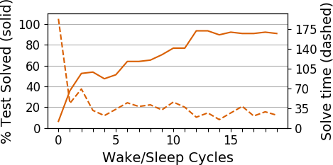

# Table of contents
1. [Overview](#overview)
2. [Getting Started](#getting-started)
    1. [Getting the code](#getting-the-code)
    2. [Running using singularity](#running-using-singularity)
    3. [Running tasks from the commandline](#running-tasks-from-the-commandline)
    4. [Understanding console output](#understanding-console-output)
    5. [Graphing the results](#graphing-the-results)
3. [Additional Information](#additional-information)
    1. [Creating new domains](#creating-new-domains)
    2. [Installing Python dependencies](#installing-python-dependencies)
    3. [Building the OCaml binaries](#building-the-ocaml-binaries)
    4. [Build rust compressor](#build-rust-compressor)
    5. [PyPy](#pypy)
4. [Software Architecture](#software-architecture)
5. [`protonet-networks`](#protonet-networks)
    
# Overview

DreamCoder is a wake-sleep algorithm that finds programs to solve a given set of tasks in a particular domain.

# Getting Started

This section will provide the basic information necessary to run DreamCoder.

## Usage

### Getting the code

Clone the codebase and its submodules.

The codebase has several git submodule dependencies.

If you’ve already cloned the repo and did not clone the submodules, run:
```
git submodule update --recursive --init
```

### Running using Singularity

If you don't want to manually install all the of the software dependencies locally you can instead use a singularity container. To build the container, you can use the recipe `singularity` in the repository, and run the following from the root directory of the repository (tested using singularity version 2.5):
```
sudo singularity build container.img singularity
```
Then run the following to open a shell in the container environment:
```
./container.img
```
Alternatively, one can run tasks within the container via the `singularity` command:
```
singularity exec container.img  python text.py <commandline arguments>
```

### Running tasks from the commandline

The codebase has a few scripts already defined for running tasks for a particular domain located in the `bin/` directory.

The general usage pattern is to run the script from the root of the repo as follows:
```
python bin/text.py <commandline arguments>
```

For example, see the following modules:
 * `bin/text.py` - trains the system on automatically generated text-editing tasks.
 * `bin/list.py` - trains the system on automatically generated list processing tasks.
 * `bin/logo.py`
 * `bin/tower.py`

In general, the scripts should specify the commandline options if you run the script with `--help`:
```
python bin/list.py --help
```

An example training task command might be:
```
python text.py -t 20 -RS 5000
```
This runs with an enumeration timeout and recognition timeout of 20 seconds (since recognition timeout defaults to enumeration timeout if `-R` is not provided) and 5000 recognition steps.

Use the `--testingTimeout` flag to ensure the testing tasks are run. Otherwise, they will be skipped.

See more examples of commands in the `docs/official_experiments` file.

### Understanding console output

The first output of the DreamCoder scripts - after some commandline debugging statements - is typically output from launching tasks, and will appear as follows:
```
(python) Launching list(int) -> list(int) (1 tasks) w/ 1 CPUs. 15.000000 <= MDL < 16.500000. Timeout 10.201876.
(python) Launching list(int) -> list(int) (1 tasks) w/ 1 CPUs. 15.000000 <= MDL < 16.500000. Timeout 9.884262.
(python) Launching list(int) -> list(int) (1 tasks) w/ 1 CPUs. 15.000000 <= MDL < 16.500000. Timeout 2.449733.
	(ocaml: 1 CPUs. shatter: 1. |fringe| = 1. |finished| = 0.)
	(ocaml: 1 CPUs. shatter: 1. |fringe| = 1. |finished| = 0.)
(python) Launching list(int) -> list(int) (1 tasks) w/ 1 CPUs. 15.000000 <= MDL < 16.500000. Timeout 4.865186.
	(ocaml: 1 CPUs. shatter: 1. |fringe| = 1. |finished| = 0.)
```
MDL corresponds to the space used for the definition language to store the program expressions. The MDL can be tuned by changing the `-t` timeout option, which will alter the length of time the algorithm runs as well as its performance in solving tasks.

The next phase of the script will show whether the algorithm is able to match programs to tasks. A `HIT` indicates a match and  a `MISS` indicates a failure to find a suitable program for a task:
```
Generative model enumeration results:
HIT sum w/ (lambda (fold $0 0 (lambda (lambda (+ $0 $1))))) ; log prior = -5.545748 ; log likelihood = 0.000000
HIT take-k with k=2 w/ (lambda (cons (car $0) (cons (car (cdr $0)) empty))) ; log prior = -10.024556 ; log likelihood = 0.000000
MISS take-k with k=3
MISS remove eq 3
MISS keep gt 3
MISS remove gt 3
Hits 2/6 tasks
```

The program output also contains some information about the programs that the algorithm is trying to solve each task with:
```
Showing the top 5 programs in each frontier being sent to the compressor:
add1
0.00    (lambda (incr $0))

add2
-0.29   (lambda (incr2 $0))
-1.39   (lambda (incr (incr $0)))

add3
-0.85   (lambda (incr (incr2 $0)))
-0.85   (lambda (incr2 (incr $0)))
-1.95   (lambda (incr (incr (incr $0))))
```

The program will cycle through multiple iterations of wake and sleep phases (controlled by the `-i` flag). It is worth noting that after each iteration the scripts will export checkpoint files in Python's "pickle" data format.
```
Exported checkpoint to experimentOutputs/demo/2019-06-06T18:00:38.264452_aic=1.0_arity=3_ET=2_it=2_MF=10_noConsolidation=False_pc=30.0_RW=False_solver=ocaml_STM=True_L=1.0_TRR=default_K=2_topkNotMAP=False_rec=False.pickle
```

These pickle checkpoint files are input to another script that can graph the results of the algorithm, which will be discussed in the next section.

### Graphing the results

The `bin/graphs.py` script can be used to graph the results of the program's output, which can be much easier than trying to interpret the pickle files and console output.

An example invocation is as follows:
```
python bin/graphs.py --checkpoints <pickle_file> --export test.png
```
The script takes a path to a pickle file and an export path for the image the graph will be saved at.

Here's an example of the output:


This script has a number of other options which can be viewed via the `--help` command.

See the [Installing Python dependencies](#installing-python-dependencies) section below if the `bin/graphs.py` script is complaining about missing dependencies.

Also the following error occurs if in some cases:
```
feh ERROR: Can't open X display. It *is* running, yeah?
```
If you see that error, you can run this in your terminal before running `graphs.py` to fix the issue:
```
export DISPLAY=:0
```

## Additional Information

This section includes additional information, such as the steps to rebuild the OCaml binaries, or extend DreamCoder to solve new problems in new domains.

### Creating new domains

To create new domains of problems to solve, a number of things must be done. Follow the steps in [Creating New Domains](./docs/creating-new-domains.md) to get started.

Note that after a new domain is created, if any of the OCaml code has been edited it is required that you rebuild the OCaml binaries. See [Building the OCaml binaries](#building-the-ocaml-binaries) for more info.

### Installing Python dependencies

It's useful to install the Python dependencies in case you want to run certain scripts (e.g. `bin/graphs.py`) from your local machine.

To install Python dependencies, activate a virtual environment (or don't) and run:
```
pip install -r requirements.txt
```

For macOS, there are some additional system dependencies required to install these libraries in `requirements.txt`. To install these system dependencies locally, you can use homebrew to download them:
```
brew install swig
brew install libomp
brew cask install xquartz
brew install feh
brew install imagemagick
```

### Building the OCaml binaries

If you introduce new primitives for new domains of tasks, or modify the OCaml codebase (in `solvers/`) for any reason, you will need to rebuild the OCaml binaries before rerunning the Python scripts.

To rebuild the OCaml binaires, run the following from the root of the repo:
```
make clean
make
```

If you are not running within the singularity container, you will need to install the OCaml libraries dependencies first. Currently, in order to build the solver on a fresh opam switch, the following packages (anecdotal data from Arch x64, assuming you have `opam`) are required:
```bash
opam update                 # Seriously, do that one
opam switch 4.06.1+flambda  # caml.inria.fr/pub/docs/manual-ocaml/flambda.html
eval `opam config env`      # *sight*
opam install ppx_jane core re2 yojson vg cairo2 camlimages menhir ocaml-protoc zmq
```

Now try to run `make` in the root folder, it should build several ocaml
binaries.

### Build rust compressor

Get Rust (e.g. `curl https://sh.rustup.rs -sSf | sh` according to
[https://www.rust-lang.org/](https://www.rust-lang.org/en-US/install.html))

Now running make in the `rust_compressor` folder should install the right
packages and build the binary.

### PyPy

If for some reason you want to run something in pypy, install it from:
```
https://github.com/squeaky-pl/portable-pypy#portable-pypy-distribution-for-linux
```
Be sure to add `pypy3` to the path. Really though you should try to
use the rust compressor and the ocaml solver. You will have to
(annoyingly) install parallel libraries on the pypy side even if you
have them installed on the Python side:

```
pypy3 -m ensurepip
pypy3 -m pip install --user vmprof
pypy3 -m pip install --user dill
pypy3 -m pip install --user psutil
```

## Software Architecture

To better understand how dreamcoder works under the hood, see the [Software Architecture](./docs/software-architecture.md) document.

## `protonet-networks`

### Credit of (most of) the `protonet` code

The `protonet-networks` folder contains some modifications over a big chunk of
code from [this repository](https://github.com/jakesnell/prototypical-networks), here is the attribution information :

> Code for the NIPS 2017 paper [Prototypical Networks for Few-shot Learning](http://papers.nips.cc/paper/6996-prototypical-networks-for-few-shot-learning.pdf)

If you use that part of the code, please cite their paper, and check out
what they did:

```bibtex
@inproceedings{snell2017prototypical,
  title={Prototypical Networks for Few-shot Learning},
  author={Snell, Jake and Swersky, Kevin and Zemel, Richard},
  booktitle={Advances in Neural Information Processing Systems},
  year={2017}
}
```

### LICENSE of `protonets-networks` folder

MIT License

Copyright (c) 2017 Jake Snell

Permission is hereby granted, free of charge, to any person obtaining a copy
of this software and associated documentation files (the "Software"), to deal
in the Software without restriction, including without limitation the rights
to use, copy, modify, merge, publish, distribute, sublicense, and/or sell
copies of the Software, and to permit persons to whom the Software is
furnished to do so, subject to the following conditions:

The above copyright notice and this permission notice shall be included in all
copies or substantial portions of the Software.

THE SOFTWARE IS PROVIDED "AS IS", WITHOUT WARRANTY OF ANY KIND, EXPRESS OR
IMPLIED, INCLUDING BUT NOT LIMITED TO THE WARRANTIES OF MERCHANTABILITY,
FITNESS FOR A PARTICULAR PURPOSE AND NONINFRINGEMENT. IN NO EVENT SHALL THE
AUTHORS OR COPYRIGHT HOLDERS BE LIABLE FOR ANY CLAIM, DAMAGES OR OTHER
LIABILITY, WHETHER IN AN ACTION OF CONTRACT, TORT OR OTHERWISE, ARISING FROM,
OUT OF OR IN CONNECTION WITH THE SOFTWARE OR THE USE OR OTHER DEALINGS IN THE
SOFTWARE.
