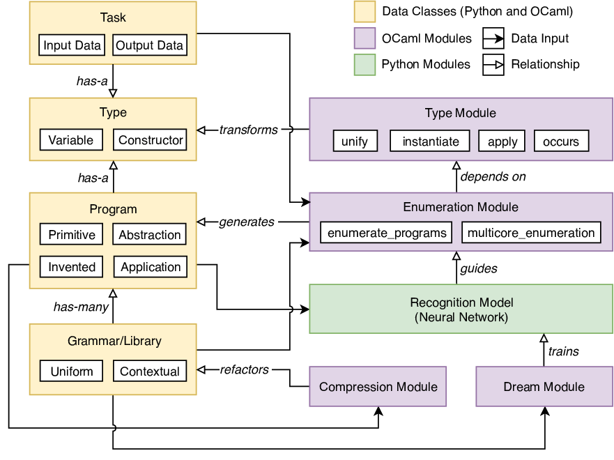
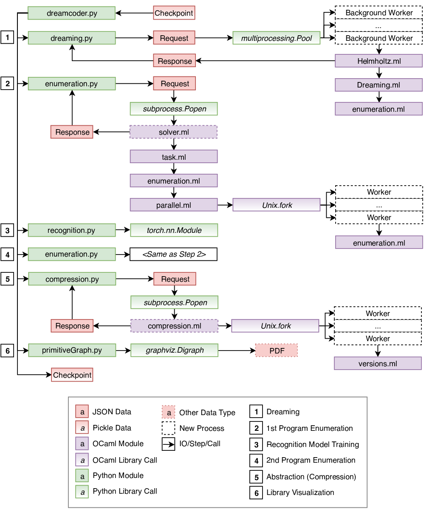

Software Architecture
=====================

This section is meant to assist readers who want to use and interpret the 
DreamCoder software. It should serve as a guide for those who wish to 
understand, install and run the code for their own experiments, or reuse 
specific components of the code in future research. Please note that class 
names and module names are subject to change, but the primary 
relationships between the different components and a description of the 
data types are documented below as accurately as possible.

The system is made up of a hybrid of Python and OCaml modules in which the 
OCaml code functions as a performant backend and the Python code functions 
as a high-level frontend that interfaces with the backend. One notable 
exception to this rule is the neural network code of the recognition model,
which is written in Python and uses the PyTorch deep learning library.

The code contains experimental Python and Rust implementations of several of 
the modules described below, which can be toggled by command-line flags, 
but it is simplest to describe the default workflow where the OCaml 
backend is used for enumeration (waking), compression (abstraction), and 
dreaming. Advanced usage of DreamCoder using the different implementations 
is covered by the help options of the DreamCoder command-line interface.

In order to understand how the Python and OCaml parts of the codebase fit 
together, it is useful to outline the primary modules within the 
DreamCoder system, the different types of data passed between the modules, 
and the relationships between the data types. The next section will cover 
these three items. Then, the fundamental sequence of events and exchange 
of data at each of the major steps of DreamCoder's execution will be 
described below.

Data Types and Modules
----------------------

The primary data types, modules, and their relationships are depicted in 
the above figure. Data classes are shared between Python and OCaml, since 
both parts of the codebase require the ability to interpret and modify 
each of the primary data types. Data objects are serialized to and 
deserialized from JSON when the backend and frontend communicate. The data 
classes in the code approximately match the terms used in this paper.

`Program` objects represent the programs that DreamCoder generates to solve 
tasks. These programs are generated by the enumeration module `enumeration.ml`.
Programs are represented as lambda-calculus expressions using deBuijn indices. 
and some program types (e.g. the `Application` and `Abstraction` classes) have 
a nested structure allowing programs to include other programs. This nested 
structure allows the system to satisfy the requirement of representing complex programs in a lambda calculus format. 
The `Primitive` program type is used to specify programs that make up the 
initial library and are composed into larger, more complex programs during 
enumeration.

`Program` objects specify a type attribute that corresponds to the `Type` 
class. The `Type` can be either a ground type (e.g. `int, bool`), a type 
variable (e.g. alpha, beta, gamma) or a type built from type constructors (
e.g. `list[int]`, `char->bool`, `alpha->list[alpha]`). Type objects are used 
to represent a type system capable of describing the expected input and output 
types of a program, as well as to ensure that a generated program is 
well-typed during enumeration. The type module `type.ml` contains routines for 
creating and transforming types, such as the `instantiate`, `unify`, and `apply`
methods. These routines are imported by the enumeration module and called when 
building candidate programs during enumeration. The `Task` data 
that specifies input-output examples also references a `Type` class used to 
match tasks with suitable programs during enumeration.

`Grammar` objects contain the initial and learned library of code mentioned 
throughout this paper. A `Grammar` object is composed of a set of `Program` 
objects, namely `Primitive` and `Invented` programs, as well as a numerical 
weight used to calculate the probability of a given program being used when 
creating new programs. The `Grammar` data serves 
as input to the enumeration module, because the enumeration routines create 
programs from the current library. This `Grammar` data is also input to the 
dream module `helmholtz.ml`, which generates training data for the recognition 
model (trained in `recognition.py`), and the `compression.ml` module updates 
the library. In this way, the DreamCoder system uses `Grammar` objects to 
iteratively create and update a library in addition to generating programs 
from that changing library.

This web of relationships between the modules and data of the system is described from a sequential perspective of the program's workflow steps in the following section.

Program Workflow
----------------

DreamCoder's workflow is outlined in the above figure. This 
figure is a sequential diagram of each of the major steps that occur during 
the system's life-cycle. These steps include: (1) dreaming, which occurs in 
parallel with (2) program enumeration from the current library, then 
sequentially (3) recognition model training, (4) program enumeration guided by 
the recognition model, (5) abstraction or compression, and (6) library 
visualization.

The entry point to the system is the `dreamcoder.py` module, which processes 
the command-line arguments specified by the user and iteratively invokes each 
of the following steps. The system optionally takes a checkpoint file as input 
to resume training from a previous state. Neural network state and metadata 
are serialized to or deserialized from binary files using the `pickle` module 
from Python's standard library. Checkpointing occurs at the end of each 
iteration of DreamCoder's execution. In addition to allowing the system to 
restart from a previous state, checkpoint files can be used to graph the 
system's performance during training and testing via the `bin/graphs.py` 
script. This script is used to create the graphs of the performance featured 
elsewhere in the paper.

In Step 1, the `dreamcoder.py` module calls `dreaming.py` module, which 
creates multiple background workers that run OCaml processes in parallel. 
These processes generate dreams. The Python frontend communicates a request to 
the OCaml backend in JSON format after serializing the current library to 
JSON. The OCaml processes return responses asynchronously after enumerating 
sets of different programs that solve the requested tasks. The response data 
contains these sets of programs which are later used to train the recognition 
model in Step 3.

In Step 2, in parallel with Step 1, the system begins enumerating programs 
built from the current library, which is isomorphic to the dreaming process 
and, like dreaming, is launched by the `enumeration.py` module. The Python 
frontend spawns a new child process to run the `solver.ml` OCaml module which 
executes enumeration in parallel. The degree of parallelization is controlled 
by command-line flags, causing the algorithm to run on a parameterizable 
number of CPUs. Generated programs that successfully solve the input tasks are 
represented in a lambda calculus and returned in JSON format to the parent 
Python process.

In Step 3, the `recognition.py` module trains a neural network with PyTorch as 
a backend. The network is trained to predict the most likely program solving 
each task, both actual training tasks and dreamed tasks. During training, 
programs are sampled from the dreaming response data of Step 1.

In Step 4, we enumerate programs, for each task, from the current library, 
guided by the recognition model's output for each task.

In Step 5, the `compression.py` frontend module spawns a child process to 
invoke the OCaml `compression.ml` module, which implements the compression 
procedure. The OCaml module receives a 
request with the current programs produced by the previous wake cycles, and 
returns a new library in the response JSON.

In Step 6, the `primitiveGraph.py` module creates a snapshot of the current 
primitives in the library. This snapshot is saved as a PDF file, allowing for 
later inspection of the state of DreamCoder's library at any iteration in the 
program's life-cycle. Examples of the learned library routines shown in the 
figures of the DreamCoder paper, are drawn from these primitive snapshots.

After all steps have been completed, a final checkpoint file is created for 
the iteration. The above steps are iterated over in a loop limited by 
hyperparameters set by command-line flags (e.g. iteration count, enumeration 
timeout, limit on recognition model's training time and number of
gradient steps).
